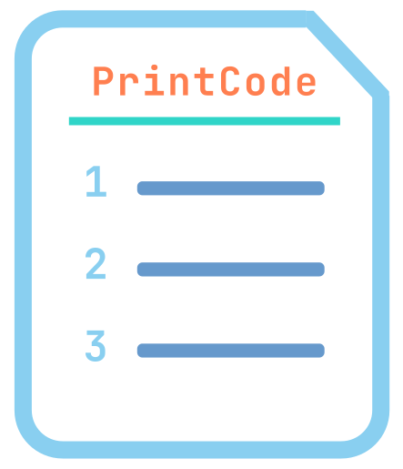
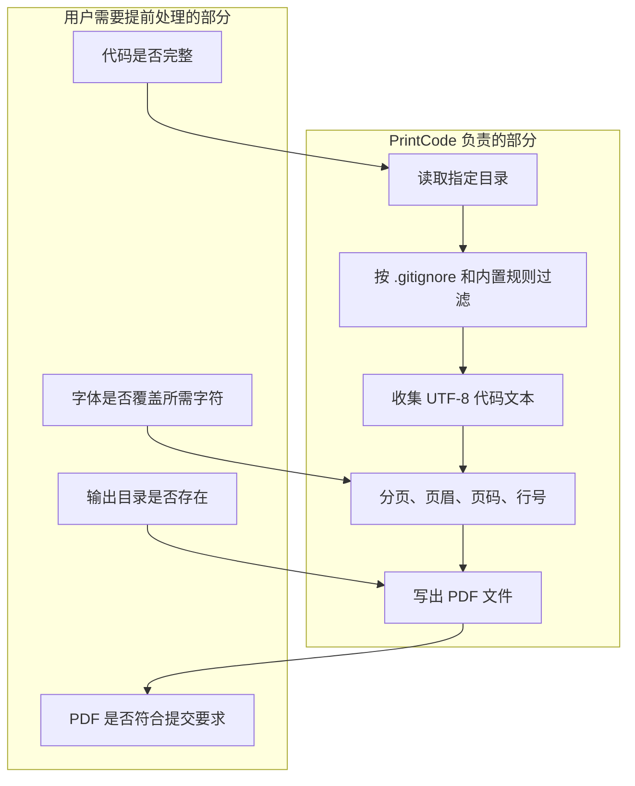
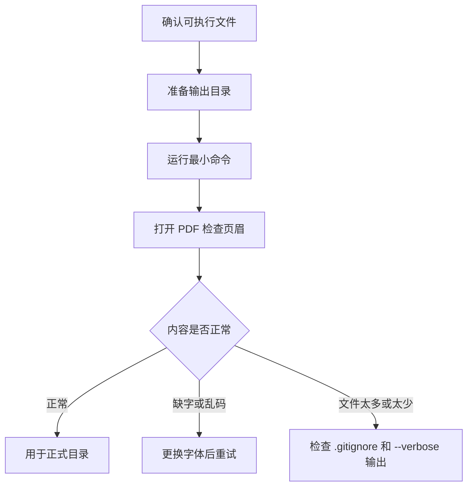
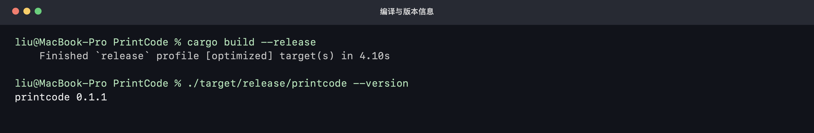
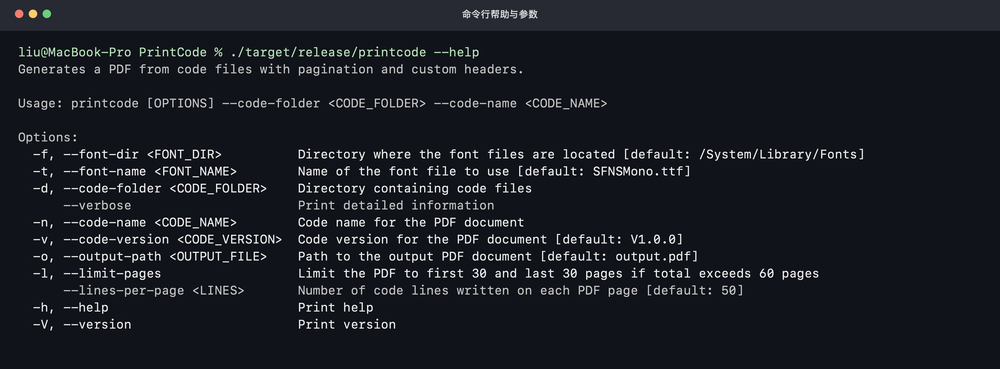
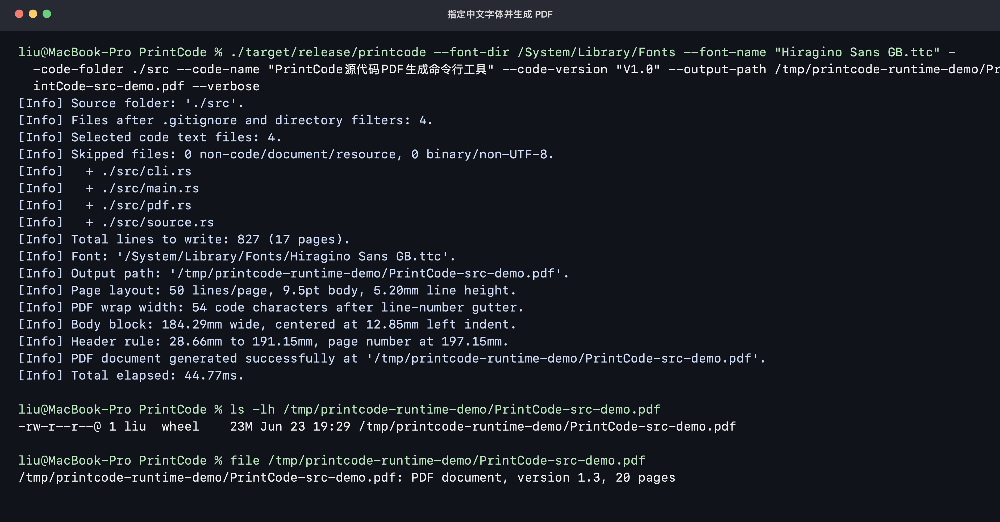
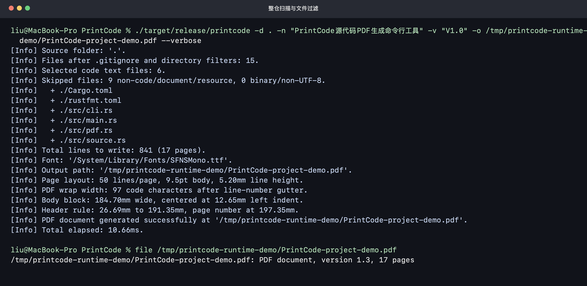
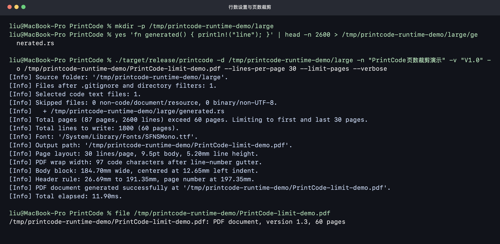
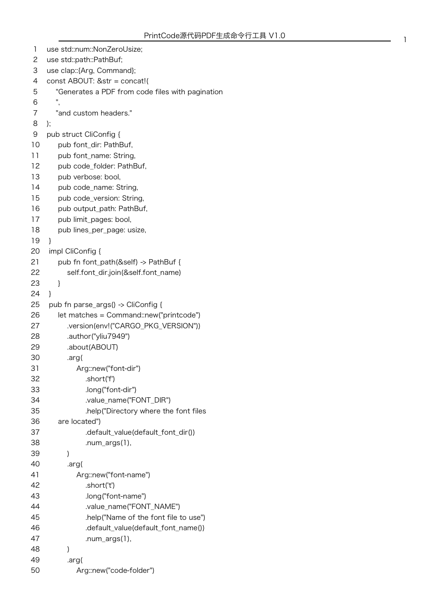

# PrintCode 源代码打印命令行工具 V1.0 使用手册

<p align="center">
  
</p>

## 1. 使用概览与软件边界

PrintCode 是一个把代码目录整理成 PDF 的命令行工具，软件全称可表述为“源代码打印命令行工具 V1.0”。它会扫描指定目录里的代码文件，过滤掉文档、图片、构建产物和二进制文件，然后按固定行数分页，生成带页眉、页码和代码行号的 A4 PDF。

本软件无图形化运行界面，运行界面为操作系统终端、命令提示符或 PowerShell 等命令行窗口，也没有“导入项目”“选择文件”“预览打印”这类窗口操作。日常使用就是一条命令：指定代码目录、软件名称、版本号和输出 PDF 路径。这个定位比较适合做程序鉴别材料、项目归档、代码审阅附件，或者把某个模块打印成纸质材料。


<p align="center"><strong>图 1 PrintCode 的典型使用路径</strong></p>

建议第一次使用时按下面的顺序来：

1. 先用一个小目录试跑，比如只放 `src/` 下的几份代码；
2. 打开生成的 PDF，看页眉里的名称和版本号是否正确；
3. 如果代码里有中文注释，确认字体能正常显示中文；
4. 再对正式项目目录执行命令，并按需要打开 `--limit-pages`；
5. 最后用 `--verbose` 看一下实际入选了哪些文件。

## 2. 软件定位

### 2.1 它解决什么问题

一些场景里需要把源代码以文档形式提交或留档。手工复制代码到 Word 里容易漏文件、格式混乱，页眉页码也要自己调。PrintCode 的作用就是把这件事做成可重复的一条命令。

常见用途如下：

| 场景 | 推荐做法 |
| --- | --- |
| 软件著作权程序鉴别材料 | 使用 `--limit-pages`，超过 60 页时只保留前 30 页和后 30 页 |
| 研发归档 | 指定完整源码目录，保留默认每页 50 行 |
| 只打印某个模块 | 把 `--code-folder` 指向模块目录，例如 `./src/backend` |
| 代码评审附件 | 用 `--lines-per-page` 调小行数，给批注留出更多空白 |
| 有中文注释的项目 | 显式指定支持中文的字体文件 |

### 2.2 它不负责什么

PrintCode 不负责下面这些事情：

- 不检查代码是否能编译，也不运行测试；
- 不生成目录页，不按函数或类自动分章；
- 不做语法高亮，PDF 中是黑白代码排版；
- 不替代 Git，文件是否属于项目仍由目录和 `.gitignore` 控制；
- 不读取 Word、PDF、图片、Markdown 等文档内容；
- 不会自动创建输出目录，`--output-path` 的上级目录需要先存在。



<p align="center"><strong>图 2 软件职责和用户准备工作的边界</strong></p>

### 2.3 适用人群

本手册主要给三类用户看：

- 需要把项目源码整理成 PDF 的开发人员；
- 需要准备软著、归档或交付材料的项目负责人；
- 需要在 CI、脚本或发布流程里自动生成代码 PDF 的维护人员。

## 3. 运行环境和目录要求

### 3.1 运行环境

| 项目 | 要求 |
| --- | --- |
| 操作系统 | Windows、macOS 或 Linux |
| 运行方式 | 使用发行包中的 `printcode` / `printcode.exe`，或从源码用 Cargo 编译 |
| 字体 | TTF、OTF、TTC 等可解析字体，建议用等宽字体 |
| 代码文本 | UTF-8 文本文件；二进制文件和非 UTF-8 文件会被跳过 |
| 输出文件 | PDF，默认文件名为 `output.pdf` |

不同平台有默认字体：

| 平台 | 默认字体目录 | 默认字体名 |
| --- | --- | --- |
| Windows | `C:/Windows/Fonts` | `simsun.ttc` |
| macOS | `/System/Library/Fonts` | `SFNSMono.ttf` |
| Linux | `/usr/share/fonts` | `truetype/dejavu/DejaVuSansMono.ttf` |

如果 PDF 里出现方框、问号或乱码，通常不是代码坏了，而是当前字体缺少这些字符。中文注释较多的项目，Windows 可先试 `simsun.ttc`，Linux 可安装并指定 Noto CJK 一类字体。

### 3.2 发行包目录

拿到编译好的发行包后，目录一般类似下面这样：

```text
PrintCode/
  printcode              # macOS / Linux 可执行文件
  printcode.exe          # Windows 可执行文件
  README.md
  LICENSE
```

从源码编译时，可执行文件会在：

```text
target/
  release/
    printcode            # macOS / Linux
    printcode.exe        # Windows
```

### 3.3 输入目录建议

`--code-folder` 可以指向整个项目，也可以只指向某个源码子目录。正式生成前建议先看一眼目录：

```text
my_project/
  src/
  Cargo.toml
  README.md
  target/
  docs/
```

在这个例子里，`src/` 和 `Cargo.toml` 会被纳入候选；`README.md`、`docs/` 里的文档、`target/` 构建产物会被跳过。实际结果可以用 `--verbose` 查看。

## 4. 快速上手



<p align="center"><strong>图 3 第一次生成 PDF 的检查流程</strong></p>

### 4.1 macOS 示例

在项目根目录执行：

```bash
mkdir -p dist

./target/release/printcode \
  --code-folder ./src \
  --code-name "PrintCode" \
  --code-version "V1.0" \
  --output-path ./dist/PrintCode-code.pdf \
  --verbose
```

如果使用发行包，把 `./target/release/printcode` 换成发行包里的实际路径即可。

### 4.2 Windows 示例

Windows 下可以显式指定系统自带宋体：

```powershell
mkdir dist

.\printcode.exe `
  --font-dir C:/Windows/Fonts `
  --font-name simsun.ttc `
  --code-folder .\src `
  --code-name "MyProject" `
  --code-version "V1.0.0" `
  --output-path .\dist\MyProject-code.pdf `
  --verbose
```

命令跑完后，打开 `dist\MyProject-code.pdf`，先看第一页页眉是否是 `MyProject V1.0.0`。

### 4.3 Linux 示例

英文代码项目通常可以直接使用默认 DejaVu Sans Mono：

```bash
mkdir -p dist

./printcode \
  -d ./backend \
  -n "BackendService" \
  -v "V2.3.1" \
  -o ./dist/backend-code.pdf \
  --lines-per-page 55
```

如果代码里有中文，建议换成支持中文的字体。例如：

```bash
./printcode \
  -d ./backend \
  -n "BackendService" \
  -v "V2.3.1" \
  -o ./dist/backend-code.pdf \
  --font-dir /usr/share/fonts/opentype/noto \
  --font-name NotoSansCJK-Regular.ttc
```

### 4.4 从源码编译

没有现成可执行文件时，可以用 Rust 工具链编译：

```bash
git clone https://git.lug.ustc.edu.cn/gleamoe/PrintCode.git
cd PrintCode
cargo build --release
```

编译完成后运行：

```bash
./target/release/printcode --help
```

能看到参数说明，就可以继续生成 PDF。

## 5. 命令行参数

PrintCode 的命令格式如下：

```text
printcode [OPTIONS] --code-folder <CODE_FOLDER> --code-name <CODE_NAME>
```

常用参数见下表：

| 参数 | 简写 | 是否必填 | 默认值 | 说明 |
| --- | --- | --- | --- | --- |
| `--code-folder <CODE_FOLDER>` | `-d` | 是 | 无 | 要扫描的代码目录 |
| `--code-name <CODE_NAME>` | `-n` | 是 | 无 | PDF 页眉中的代码名称 |
| `--code-version <CODE_VERSION>` | `-v` | 否 | `V1.0.0` | PDF 页眉中的版本号 |
| `--output-path <OUTPUT_FILE>` | `-o` | 否 | `output.pdf` | 输出 PDF 路径 |
| `--font-dir <FONT_DIR>` | `-f` | 否 | 随平台变化 | 字体所在目录 |
| `--font-name <FONT_NAME>` | `-t` | 否 | 随平台变化 | 字体文件名 |
| `--limit-pages` | `-l` | 否 | 关闭 | 超过 60 页时保留前 30 页和后 30 页 |
| `--lines-per-page <LINES>` | 无 | 否 | `50` | 每页写入的代码行数 |
| `--verbose` | 无 | 否 | 关闭 | 输出扫描统计、入选文件和版式信息 |
| `--help` | `-h` | 否 | 无 | 查看帮助 |
| `--version` | `-V` | 否 | 无 | 查看程序版本 |

最短可用命令通常是：

```bash
printcode -d ./src -n "MyProject"
```

这会生成 `output.pdf`，页眉版本号默认为 `V1.0.0`。

## 6. 代码扫描和过滤规则

### 6.1 文件是怎么被选中的

PrintCode 会先遍历 `--code-folder`，并读取该目录内及子目录中的 `.gitignore`。被 `.gitignore` 忽略的文件不会进入后续筛选。目录外父级 `.gitignore`、全局 Git ignore 和 `.ignore` 文件不参与。

之后它会按内置规则挑选代码文件：

| 类型 | 示例 |
| --- | --- |
| 常见源码扩展名 | `.rs`、`.py`、`.java`、`.js`、`.ts`、`.cpp`、`.c`、`.go`、`.m`、`.sql` |
| Web 和配置代码 | `.html`、`.css`、`.vue`、`.xml`、`.yaml`、`.toml` |
| 常见构建文件名 | `Cargo.toml`、`Dockerfile`、`Makefile`、`CMakeLists.txt`、`package.json`、`pom.xml` |

README、Markdown、PDF、Word、Excel、图片、SVG、压缩包等不会进入 PDF。这样做的目的是让输出内容尽量接近“源代码材料”，不要混进说明书或截图。

### 6.2 会直接跳过的目录

下面这些目录即使没有写进 `.gitignore`，也会被跳过：

```text
.cargo
.git
.github
.gradle
.idea
.next
.nuxt
.vscode
build
coverage
dist
node_modules
out
target
vendor
```

如果你的项目把手写源码放在 `vendor/` 或 `build/` 这种目录名下面，建议先复制到一个临时目录再生成 PDF。

### 6.3 `.gitignore` 示例

例如前端项目中有压缩后的文件和自动生成代码，可以这样写：

```gitignore
node_modules/
dist/
coverage/
*.min.js
generated/
!generated/api-types.ts
```

这时 `generated/api-types.ts` 会被重新放回候选范围，其他 `generated/` 内容会被忽略。生成前用 `--verbose` 看入选文件，比事后在 PDF 里翻要快很多。

### 6.4 空白行和换行

PrintCode 会过滤掉完全空白的行。较长的代码行会先按文本宽度预换行，写入 PDF 时还会根据字体和页面宽度再做一次换行，避免超出右边界。

这意味着 PDF 里的页内行号不是原始源码行号，而是排版后的页内行号。提交材料时一般关注内容连续性和可读性；如果需要精确源码行号，建议另行使用代码浏览器或 `git blame`。

## 7. PDF 版式说明

生成的 PDF 默认为 A4 页面。页眉居中显示代码名称和版本号，右上角显示页码，中间有一条横线。正文使用较小字号的等宽排版，左侧有四位页内行号。


<p align="center"><strong>图 4 PrintCode 生成的 PDF 页面示例</strong></p>

主要版式参数如下：

| 项目 | 默认值 |
| --- | --- |
| 页面大小 | A4，210 mm x 297 mm |
| 正文字号 | 9.5 pt |
| 页眉字号 | 10 pt |
| 默认每页行数 | 50 行 |
| 行高 | 约 5.2 mm |
| 页眉内容 | `<代码名称> <代码版本>` |
| 页码位置 | 页眉右侧 |

如果想让一页放更多内容，可以把每页行数调高：

```bash
printcode -d ./src -n "MyProject" --lines-per-page 60
```

如果希望打印出来更松一点，可以调低：

```bash
printcode -d ./src -n "MyProject" --lines-per-page 45
```

## 8. 真实运行截图与操作说明

本节截图来自 macOS 终端环境中对 PrintCode 的真实运行过程。由于本软件为命令行工具，无独立图形化窗口，用户通过终端输入命令和参数完成编译、查看帮助、扫描源码、设置字体、设置页眉名称和版本、生成 PDF、调整每页行数及裁剪页数等操作。

### 8.1 编译、启动和版本核验

从源码使用时，先在项目根目录执行 `cargo build --release` 编译发行版可执行文件。编译完成后执行 `./target/release/printcode --version`，终端返回 `printcode 0.1.1`，说明可执行文件已经可以正常启动并输出版本信息。



<p align="center"><strong>图 5 编译软件并查看命令行版本</strong></p>

### 8.2 查看命令行帮助

执行 `./target/release/printcode --help` 可以查看全部命令行参数。帮助界面列出了字体目录、字体文件名、源码目录、详细日志、代码名称、代码版本、输出路径、页数裁剪、每页行数、帮助和版本等入口。用户不需要进入图形菜单，直接按帮助提示组合参数即可完成操作。



<p align="center"><strong>图 6 查看软件全部命令行参数</strong></p>

### 8.3 指定中文字体并生成 PDF

生成 PDF 时，用户在终端输入 `printcode` 命令，并指定字体目录、字体文件名、源码目录、软件名称、版本号和输出路径。下图中软件扫描 `./src` 目录，选中 4 个源码文件，使用 `Hiragino Sans GB.ttc` 字体生成带中文页眉的 PDF，并在详细日志中输出入选文件、总行数、页数、字体、输出路径和版式参数。



<p align="center"><strong>图 7 指定源码目录、中文字体、软件名称和版本后生成 PDF</strong></p>

### 8.4 整仓扫描和文件过滤

当 `--code-folder` 指向项目根目录时，PrintCode 会结合 `.gitignore` 和内置规则扫描文件。下图中软件在项目根目录共扫描到 15 个候选文件，最终只选中 `Cargo.toml`、`rustfmt.toml` 和 `src/` 下的 4 个 Rust 源码文件，跳过 README、PDF、SVG、许可证、文档和其他非源码资源，从而保证生成内容主要体现源程序和必要构建配置。



<p align="center"><strong>图 8 整仓扫描并过滤非源码文件</strong></p>

### 8.5 调整每页行数和裁剪页数

软著程序鉴别材料常需要提交连续前 30 页和连续后 30 页。下图先准备一个 2600 行的源码样例，再使用 `--lines-per-page 30` 调整每页代码行数，并开启 `--limit-pages`。日志显示原始内容共 87 页，超过 60 页后软件自动保留前 30 页和后 30 页，最终写出 1800 行、60 页 PDF。



<p align="center"><strong>图 9 设置每页行数并裁剪超过 60 页的源代码材料</strong></p>

### 8.6 检查生成 PDF 的页面效果

生成完成后打开 PDF，可以看到页眉中包含软件名称和版本号，右上角显示页码，正文按代码内容逐行排版，并在左侧显示页内行号。该页面体现了软件的核心输出结果：把源码目录自动整理为可打印、可提交的 A4 PDF 程序鉴别材料。



<p align="center"><strong>图 10 真实生成 PDF 的首页预览</strong></p>

## 9. 常用示例

### 9.1 生成软著程序鉴别材料

很多软著材料只要求连续前 30 页和连续后 30 页。可以直接开启 `--limit-pages`：

```bash
mkdir -p dist

printcode \
  -d ./src \
  -n "库存管理系统" \
  -v "V1.0" \
  -o ./dist/库存管理系统_源代码.pdf \
  --limit-pages \
  --verbose
```

如果总页数不超过 60 页，PrintCode 会保留全部内容；如果超过 60 页，会保留前 30 页和后 30 页。

### 9.2 打印整个 Rust 项目

对 Rust 项目，`Cargo.toml` 会被识别为代码相关配置文件：

```bash
printcode \
  -d . \
  -n "PrintCode" \
  -v "V1.0" \
  -o ./PrintCode-source.pdf \
  --verbose
```

输出日志里会列出前 20 个入选文件。看到 `target/` 没有出现是正常的，它本来就应该被过滤。

### 9.3 只打印某个子模块

例如一个仓库里有前端和后端：

```text
project/
  apps/web/
  services/api/
  packages/shared/
```

只打印后端服务时：

```bash
printcode \
  -d ./services/api \
  -n "ApiService" \
  -v "V2.0" \
  -o ./ApiService-code.pdf
```

这样 PDF 中不会混入 `apps/web/` 的前端代码。

### 9.4 指定中文字体

如果 PDF 里的中文注释显示为空白、方框或问号，换一个字体通常就能解决。

Windows：

```powershell
.\printcode.exe -d .\src -n "数据采集工具" -v "V1.0" `
  -o .\数据采集工具_code.pdf `
  --font-dir C:/Windows/Fonts `
  --font-name simsun.ttc
```

Linux：

```bash
printcode -d ./src -n "数据采集工具" -v "V1.0" \
  -o ./data-tool-code.pdf \
  --font-dir /usr/share/fonts/opentype/noto \
  --font-name NotoSansCJK-Regular.ttc
```

### 9.5 检查到底收了哪些文件

如果生成出来页数明显不对，先加 `--verbose`：

```bash
printcode -d . -n "MyProject" -o ./check.pdf --verbose
```

日志里重点看几行：

```text
[Info] Files after .gitignore and directory filters: 42.
[Info] Selected code text files: 12.
[Info] Skipped files: 28 non-code/document/resource, 2 binary/non-UTF-8.
[Info]   + src/main.rs
[Info]   + src/pdf.rs
```

如果入选文件太少，多半是 `.gitignore` 写得太宽，或者代码文件不是 UTF-8。入选文件太多时，优先检查是不是把临时目录、生成目录或第三方源码放进了 `--code-folder`。

## 10. 常见问题

### 10.1 为什么没有生成 PDF？

先看命令行是否报错。最常见的是输出目录不存在，例如 `-o dist/code.pdf` 但还没有 `dist/` 目录。先执行：

```bash
mkdir -p dist
```

再重新运行命令。

### 10.2 为什么 PDF 里中文乱码？

当前字体不支持中文，或者字体文件无法正确解析。换一个 CJK 字体再试。Windows 可试 `simsun.ttc`；Linux 可安装 Noto CJK；macOS 可以在系统字体目录里选择支持中文的字体。

### 10.3 为什么 README 没有出现在 PDF 里？

这是预期行为。PrintCode 主要生成源代码材料，Markdown、PDF、Word、图片和 SVG 这类文档或资源文件默认会被跳过。

### 10.4 为什么某个 `.rs` / `.py` 文件没有出现？

按下面顺序检查：

1. 它是否被当前目录或上级子目录里的 `.gitignore` 忽略；
2. 它是否放在 `target/`、`dist/`、`vendor/` 等会被跳过的目录里；
3. 它是不是非 UTF-8 编码；
4. 运行时是否把 `--code-folder` 指到了正确目录。

### 10.5 `--limit-pages` 会不会打乱顺序？

不会。它只在总页数超过 60 页时裁剪中间部分，保留原始顺序中的前 30 页和后 30 页。总页数不超过 60 页时不裁剪。

### 10.6 每页行数应该设多少？

默认 50 行比较稳。代码很短、想节省页数可以设到 55 或 60；如果要打印出来人工批注，可以设成 45 左右。行数太高时，页面会显得挤，长行换行也会更明显。

## 11. 开发和维护

源码按职责拆在 `src/` 目录：

| 文件 | 说明 |
| --- | --- |
| `src/main.rs` | 程序入口，串起参数解析、代码收集和 PDF 写出 |
| `src/cli.rs` | 命令行参数和平台默认字体 |
| `src/source.rs` | 递归扫描、`.gitignore` 处理、代码文件过滤、页数裁剪 |
| `src/pdf.rs` | PDF 页面、页眉、页码、行号和正文排版 |

开发时常用命令：

```bash
cargo fmt
cargo test
cargo clippy --all-targets --all-features
cargo build --release
```

如果改了扫描规则，建议至少跑一次带 `--verbose` 的真实项目生成，确认入选文件符合预期。如果改了 PDF 版式，建议打开生成文件检查第一页、中间页和最后一页，尤其看页眉、页码和长行换行。

## 12. 使用前检查清单

正式提交或归档前，可以按这张清单过一遍：

| 检查项 | 建议 |
| --- | --- |
| 代码目录 | `--code-folder` 指向的是最终要提交的源码范围 |
| 名称和版本 | 第一页页眉和申请材料中的软件名称、版本一致 |
| 字体 | 中文注释、特殊符号没有缺字 |
| 页数 | 需要 60 页材料时已启用 `--limit-pages` |
| 入选文件 | `--verbose` 输出中没有混入构建产物和第三方依赖 |
| 输出路径 | PDF 文件名清楚，输出目录已存在 |

一般来说，先用 `--verbose` 生成一版检查 PDF，再去掉或保留 `--verbose` 生成正式文件，会少踩很多小坑。
